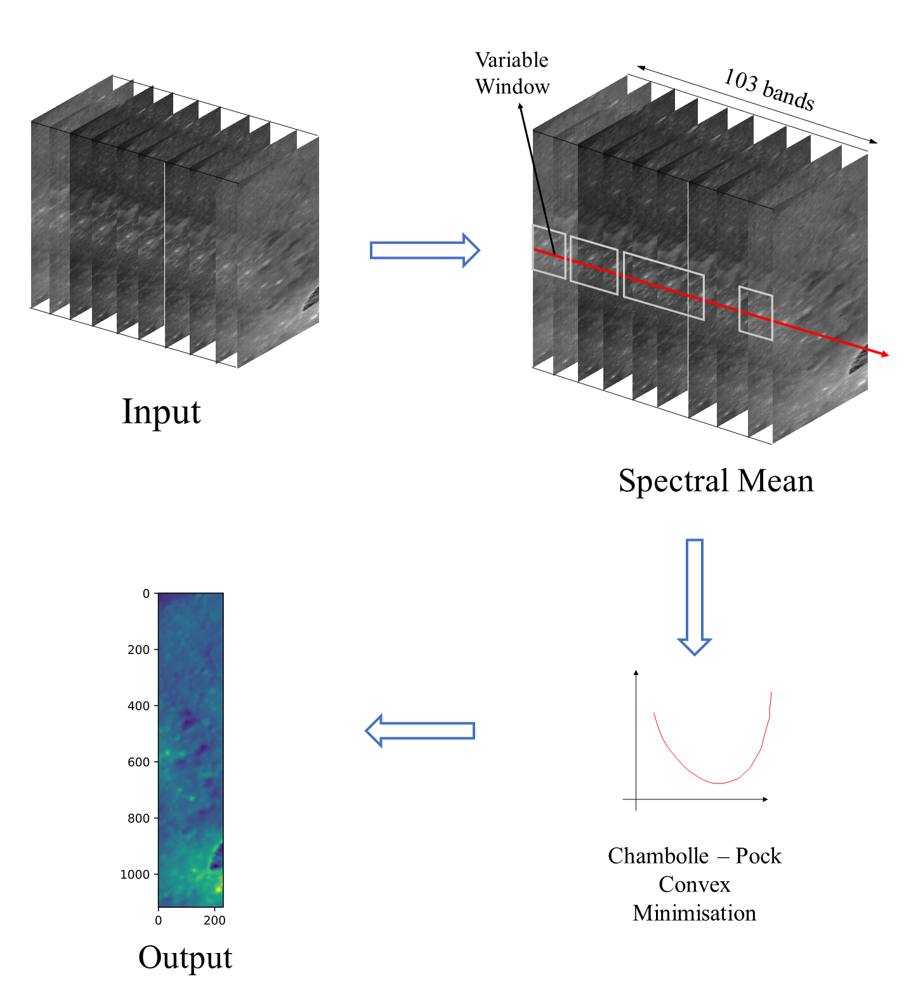
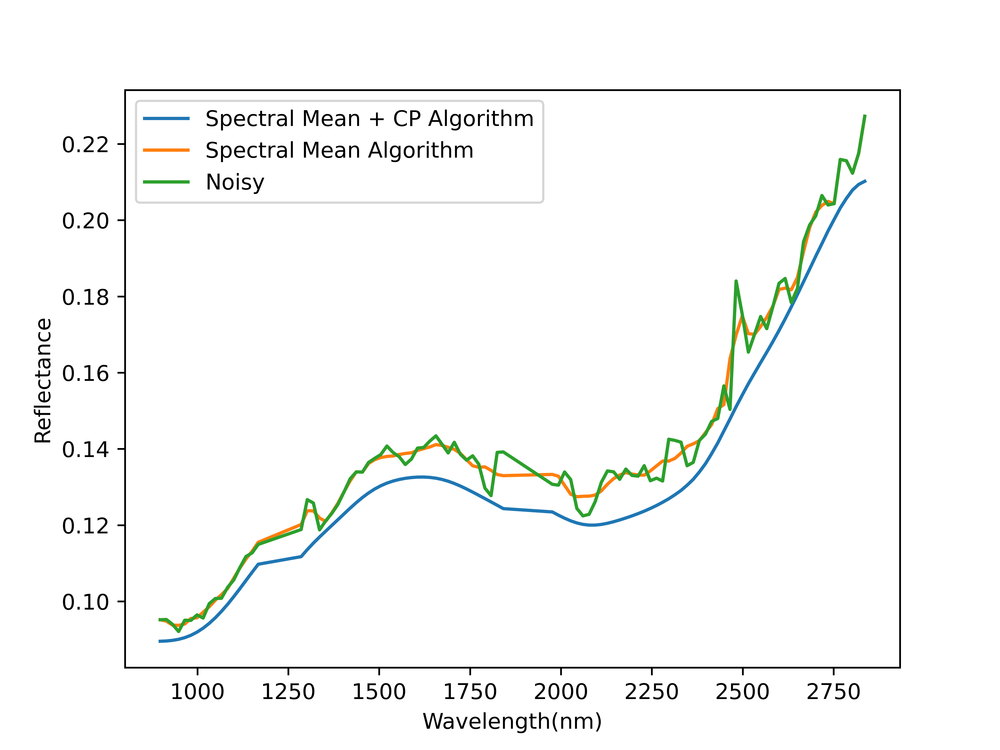
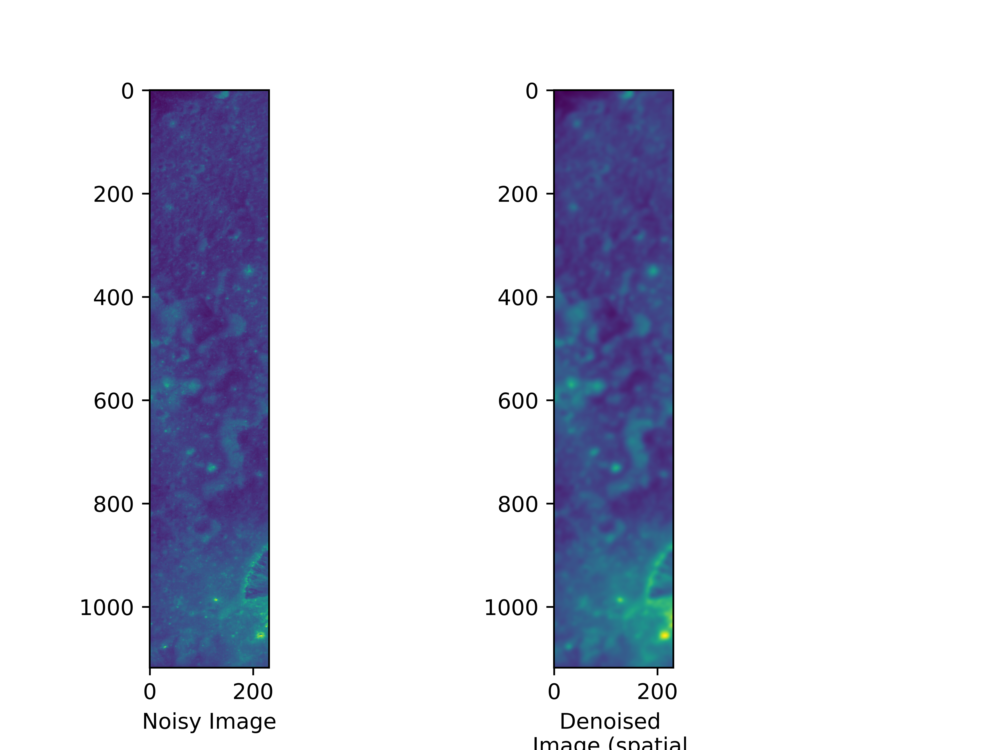

# Implementation of Cascasding Total Variational Denoising Algorithms for Denoising IIRS hyperspectral images.

The hyperspectral data captured by Imaging Infrared Spectrometer (IIRS) on board Chandrayaan-II lunar mission is a valuable resource for this research. Therefore in this research, two types of noise namely - high and low frequency noise were targeted and for which cascading total variational denoising (C-TVD) was carried out on hyperspectral data of IIRS. The cascading follows a couple of methods which utilizes a windowed spectral mean technique along the spectral dimension, followed by a denoising methodology given by Chambolle et al. [1] which is based on convergence.

A cascading algorithm makes use of multiple algorithms, implemented one after the other in a sequential fashion. This could be extremely useful if one algorithm covers the limitations of the other, and vice versa. \
We have implemented TVD using 3-dimensional spectral mean denoising followed by Chambolle-Pock optimization algorithm. The initial spectral mean denoising phase uses variable window size; smaller at the beginning and the final bands of the image, and larger in the central bands. Finally, the Chambolle-Pock algorithm makes use of weights, which signifies the degree of denoising required in addition to the number of iterations specifying how many times the algorithm executes over the given image.

### Workflows:
The following shows the workflow implemented:

### Results:
Peak-SNR: 34.55dB \
 \

### Acknowledgement:
We acknowledge the use of data from the Chandrayaan-II, second lunar mission of the Indian Space Research Organisation (ISRO), archived at the Indian Space Science Data Centre (ISSDC).

### References:
[1] A. Chambolle, An algorithm for total variation minimization and applications, Journal of Mathematical Imaging and Vision, Springer, 2004, 20, 89-97.